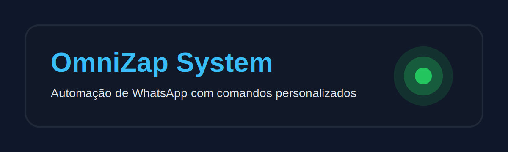

O **OmniZap System** é uma plataforma de automação para WhatsApp em Node.js com Baileys, oferecendo gerenciamento de grupos, automação de interações e comandos personalizados com suporte a MySQL.

## ✨ Recursos Principais

*   Automação e Gerenciamento de WhatsApp
*   Comandos Personalizados
*   Integração com MySQL
*   Gerenciamento de Mídia (figurinhas)
*   Monitoramento com PM2

## 🚀 Instalação

Siga os passos para configurar e executar:

## ✅ Pré-requisitos

*   Node.js 18+ (recomendado)
*   MySQL 8+
*   PM2 instalado globalmente (`npm i -g pm2`)
*   FFmpeg instalado no sistema para recursos de mídia (figurinhas)

1.  **Clone o repositório:**
    ```bash
    git clone https://github.com/Kaikybrofc/omnizap-system.git
    cd omnizap-system
    ```

2.  **Instale as dependências:**
    ```bash
    npm install
    ```

3.  **Configure as variáveis de ambiente:** Crie um arquivo `.env` na raiz do projeto:

    ```env
    # Configurações do Bot
    COMMAND_PREFIX=/
    USER_ADMIN=seu_jid_de_admin@s.whatsapp.net
    PM2_APP_NAME=omnizap-system
    LOG_LEVEL=info
    NODE_ENV=development

    # Configurações do MySQL
    DB_HOST=localhost
    DB_USER=seu_usuario
    DB_PASSWORD=sua_senha
    DB_NAME=omnizap
    DB_POOL_LIMIT=10

    # Paths e armazenamento
    STORE_PATH=./temp

    # FFmpeg (opcional) - se o binário não estiver no PATH do sistema
    # FFMPEG_PATH=/usr/bin/ffmpeg
    ```

4.  **Prepare o banco de dados:**
    *   Crie o banco indicado em `DB_NAME`.
    *   Garanta que o usuário tenha permissões de leitura e escrita.

## ▶️ Como Executar

Para iniciar, use PM2:

```bash
pm2 start ecosystem.dev.config.js # Desenvolvimento
# ou
pm2 start ecosystem.prod.config.js # Produção
```

## 📦 Scripts úteis

```bash
npm run dev
npm run start
```

## 🛠️ Tecnologias Utilizadas

*   Node.js
*   MySQL
*   @whiskeysockets/baileys
*   mysql2/promise
*   Pino
*   FFmpeg
*   WebP
*   PM2
*   Dotenv

## 🤝 Contribuições

Para contribuir:
1.  Fork o repositório.
2.  Crie sua branch (`git checkout -b feature/sua-feature`).
3.  Commit suas alterações (`git commit -m 'Adiciona nova feature'`).
4.  Push para a branch (`git push origin feature/sua-feature`).
5.  Abra um Pull Request.

## 📄 Licença

Este projeto está licenciado sob a Licença MIT. Veja [LICENSE](LICENSE) para mais detalhes.
